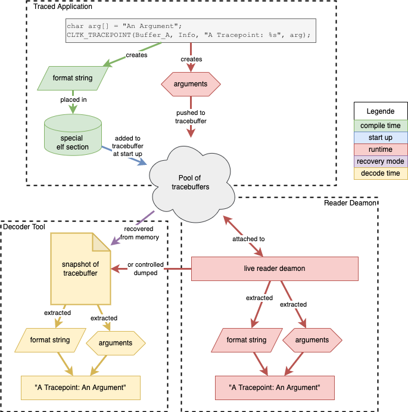
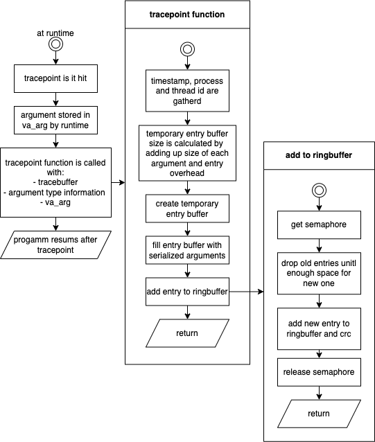

<!-- _class: lead -->

# CLLTK Architecture Overview

## Common Low Level Tracing Kit

A blazingly fast and memory efficient tracing frontend

---

# What Problem Does CLLTK Solve?

Traditional tracing approaches force a trade-off:

| Approach | Runtime Cost | Memory Cost | Information |
|----------|-------------|-------------|-------------|
| printf debugging | High | High | Full |
| Disabled in prod | Zero | Zero | None |
| Log levels | Medium | Medium | Partial |

**CLLTK's approach**: Split work across compile/load/runtime to minimize hot-path cost while preserving full information.

---

# Core Design Principle

> Capture metadata at compile time. Store only values at runtime.

```c
CLLTK_TRACEPOINT(Buffer, "User %s logged in from %s", username, ip_addr);
```

**At runtime, CLLTK stores only:**
- Reference to metadata (6 bytes)
- PID/TID (8 bytes)
- Timestamp (8 bytes)
- Argument values (variable)

**NOT stored at runtime:** format string, file name, line number, argument types

---

# System Overview



- Tracepoints capture data in your application
- Data flows to ringbuffer in trace file
- Decoder reconstructs human-readable output
- Metadata stored separately from values

---

# The Three-Stage Model

```
┌─────────────────┐    ┌─────────────────┐    ┌─────────────────┐
│   COMPILE TIME  │--->│    LOAD TIME    │--->│     RUNTIME     │
└─────────────────┘    └─────────────────┘    └─────────────────┘
        │                      │                      │
   Collect metadata       Copy metadata          Store values
   into ELF sections      to tracebuffer         to ringbuffer
        │                      │                      │
   Format string          One-time cost          Hot path:
   Argument types         per process            minimal
   File/line info         startup                overhead
```

---

# Stage 1: Compile Time

**What happens:**
- Compiler extracts format string, argument types, file name, line number
- Data placed in custom ELF section: `_clltk_<BUFFER_NAME>_meta`
- GCC `__attribute__((section(...)))` enables this

**Key insight:** All static information is known at compile time. Why compute it at runtime?

```c
// This metadata is captured ONCE during compilation:
// - Format: "User %s logged in from %s"
// - Args: [string, string]
// - File: "auth.c", Line: 42
```

---

# Stage 2: Load Time (Program Start)

**What happens:**
- Constructor with priority 101 runs before `main()`
- Metadata from ELF sections copied to tracebuffer's stack section
- Each unique metadata blob stored once (MD5 deduplication)

**Trade-off:** Slightly longer startup time for faster runtime tracing

```
ELF Binary                    Tracebuffer File
┌──────────────┐              ┌──────────────┐
│ .text        │              │ File Header  │
│ .data        │              │ Definition   │
│ _clltk_meta -+------------->│ Stack <------│ metadata here
│ ...          │              │ Ringbuffer   │
└──────────────┘              └──────────────┘
```

---

# Stage 3: Runtime (Hot Path)



**What happens when tracepoint executes:**

1. Acquire ringbuffer lock (mutex)
2. Encode: metadata offset + PID + TID + timestamp + argument values
3. Write to ringbuffer (may drop oldest entries if full)
4. Release lock

**Design goal:** Minimize hot-path overhead

---

# Component Architecture

```
┌─────────────────────────────────────────────────────────────┐
│                      TRACEBUFFER                            │
│  ┌─────────────┐  ┌─────────────────┐  ┌─────────────────┐  │
│  │ Definition  │  │   Ringbuffer    │  │     Stack       │  │
│  │             │  │                 │  │                 │  │
│  │ • Name      │  │ • Trace entries │  │ • Meta blobs    │  │
│  │ • Source    │  │ • Variable size │  │ • Deduplicated  │  │
│  │   type      │  │ • Auto-drop old │  │ • Grows only    │  │
│  └─────────────┘  └─────────────────┘  └─────────────────┘  │
└─────────────────────────────────────────────────────────────┘
         │                   │                    │
         └───────────────────┴────────────────────┘
                             │
                    Single file: <name>.clltk_trace
```

---

# Ringbuffer Design

**Why a ringbuffer?**
- Bounded memory: never grows beyond configured size
- Automatic eviction: oldest entries dropped when full
- Lock-free reads: decoder can read while app writes

**Entry structure:**
```
┌───────┬──────────┬─────┬──────────────────────────┬─────┐
│ Magic │ Body Size│ CRC │ Trace Entry Data         │ CRC │
│  ~    │  2 bytes │  8  │ (variable length)        │  8  │
└───────┴──────────┴─────┴──────────────────────────┴─────┘
```

**Integrity:** CRC8 on header and body enables recovery of valid entries even after corruption.

---

# Metadata Stack Design

**Purpose:** Store format strings, argument types, file/line info

**Why a stack (not ringbuffer)?**
- Metadata must persist for entire trace lifetime
- Entries never deleted, only added
- MD5 hash prevents duplicates

**Deduplication matters:**
- Same tracepoint in a loop = 1 metadata entry
- Same format string in different files = separate entries (different line numbers)

---

# File Format Overview

```
┌────────────────────────────────────────┐
│ File Header (56 bytes)                 │
│ • Magic: "?#$~tracebuffer\0"           │
│ • Version, offsets to sections         │
│ • CRC8 integrity check                 │
├────────────────────────────────────────┤
│ Definition Section                     │
│ • Tracebuffer name                     │
│ • Source type (userspace/kernel)       │
├────────────────────────────────────────┤
│ Ringbuffer Section                     │
│ • Header: mutex, counters, pointers    │
│ • Body: variable-length trace entries  │
├────────────────────────────────────────┤
│ Stack Section                          │
│ • Header: mutex, body size             │
│ • Body: metadata blobs (MD5 indexed)   │
└────────────────────────────────────────┘
```

---

# Performance Characteristics

**Runtime tracepoint cost is minimized by:**

- No format string parsing (done at compile time)
- No memory allocation (fixed ringbuffer)
- PID/TID cached (avoids syscall per trace)
- Timestamp via `clock_gettime` (vDSO, no syscall on Linux)
- Only argument values written (not format string)

**Trade-off:** Slightly higher program startup time (metadata copy to stack)

---

# Thread Safety Model

**Ringbuffer access:**
- `PTHREAD_MUTEX_ROBUST` + `PTHREAD_PROCESS_SHARED`
- Handles process death (mutex recovery via `EOWNERDEAD`)
- Single writer at a time, readers don't block

**Stack access:**
- Separate mutex for metadata writes
- Writes only at process startup (load time)

**Memory model:**
- Shared memory via `mmap` on trace file
- Multiple processes can trace to same buffer

---

# Design Trade-offs

| Decision | Benefit | Cost |
|----------|---------|------|
| Compile-time metadata | Fast runtime | Larger binary |
| Static buffer binding | No lookup overhead | Can't reassign at runtime |
| Ringbuffer (lossy) | Bounded memory | May lose old traces |
| File-backed mmap | Persistence, sharing | File I/O overhead |
| Priority 101 constructor | Early availability | Can't trace constructors ≤101 |

**Escape hatch:** `CLLTK_DYN_TRACEPOINT` for dynamic buffer binding (slower)

---

# Security Considerations

**File integrity:**
- Corrupted trace files can crash the decoder
- CRC checks detect but don't prevent tampering
- **Recommendation:** Restrict file permissions

**Access control:**
- Trace files are world-readable by default
- Attacker with write access can cause DoS
- **Recommendation:** Set appropriate umask, use dedicated directories

**Data sensitivity:**
- Trace data is **unencrypted**
- User controls what gets traced
- **Recommendation:** Never trace secrets, credentials, PII

---

# Integration Patterns

**Single application:**
```c
CLLTK_TRACEBUFFER(MyApp, 65536);  // 64KB buffer
```

**Multi-process (shared buffer):**
```c
// Process A and B both trace to same file
CLLTK_TRACEBUFFER(SharedBuffer, 1048576);  // 1MB shared
```

**Dynamic buffer selection:**
```c
// When buffer name not known at compile time
clltk_dynamic_tracebuffer_creation("runtime_name", 4096);
CLLTK_DYN_TRACEPOINT("runtime_name", "event: %d", code);
```

---

# Key Constraints to Remember

1. **Buffer binding is permanent** — tracepoint <-> buffer fixed at compile time
2. **Max 10 arguments** — enforced by `static_assert`
3. **Format string must be literal** — no `const char*` variables
4. **No inline member functions** — move to source file
5. **Constructor priority 101** — can't trace earlier constructors
6. **Buffer name = file name** — must be valid C identifier

---

# Summary

**CLLTK achieves low-overhead tracing by:**

1. **Shifting work left** — metadata captured at compile time
2. **Minimizing hot path** — only values stored at runtime
3. **Bounded resources** — ringbuffer with automatic eviction
4. **Self-contained files** — single `.clltk_trace` file per buffer

**Best suited for:**
- Performance-critical applications
- Long-running services
- Embedded systems with memory constraints
- Multi-process tracing scenarios

---

<!-- _class: lead -->

# Questions?

**Resources:**
- `docs/readme.asciidoc` — API documentation
- `docs/technical_documentation.asciidoc` — Implementation details
- `docs/file_specification.asciidoc` — Binary format specification
- `examples/` — Working code examples
